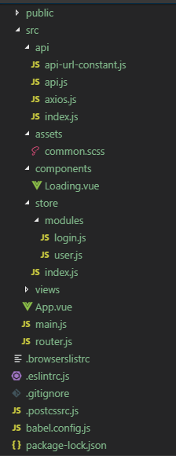

# frontend-template

## Project setup
```shell
npm install
```

### Compiles and hot-reloads for development
```shell
npm run serve
```

### Compiles and minifies for production
```shell
npm run build
```

### Lints and fixes files
```shell
npm run lint
```

# 注意事项

## 一、编码规范

目前eslint最常用的两种代码校验是Airbnb和standard。

Airbnb请参考（EN）：https://github.com/airbnb/javascript

（ZH）：https://github.com/yuche/javascript

standard请参考：https://github.com/standard/standard    or

https://standardjs.com/rules-zhcn.html

本模板采用的是eslint+standard的校验规则。standard的校验规则相对于airbnb来说更松一些。

## 二、模板目录结构和文件



* public: 存放不需要build的静态资源文件
* api:
  - api.js: 定义和导出所有后台接口调用的方法
  - api_url_constant.js: 定义所有api请求的url
  - axios.js: 全局配置axios，设置拦截器等等
  - index.js: 统一导出api模块
* assets: 存放公共静态资源，样式文件等等
* components: 存放公共组件
* store:
  - modules: 定义所有的Vuex store模块，尽量每个功能模块新建一个文件或文件夹存放，并且export时使用命名空间
  - index.js: 统一导出所有store模块
* views: 存放所有页面组件，每个功能模块一个文件夹，Home.vue为首页组件
* App.vue: 根组件
* main.js: app入口
* router.js: 路由配置文件

**所有文件夹和所有js文件统一采用kebab-case写法，所有组件（SFC）统一采用PascalCase写法，所有路由url统一采用kebab-case写法**
